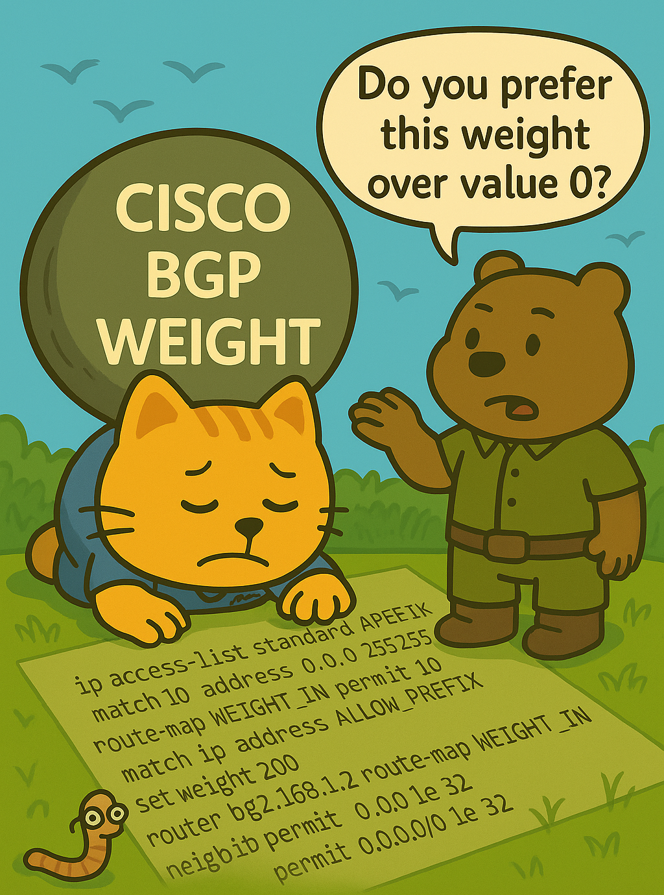
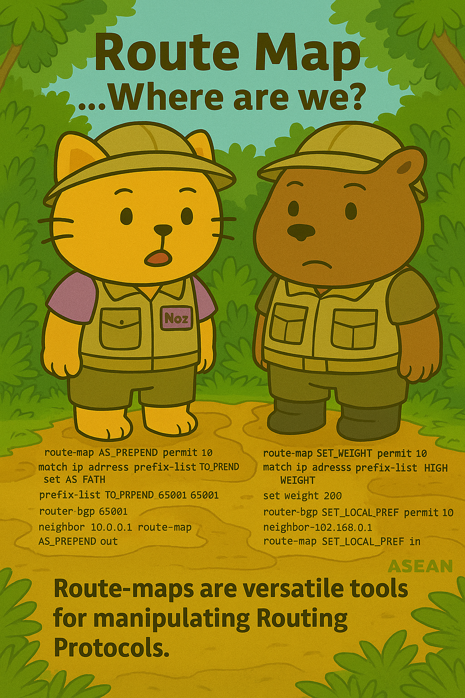
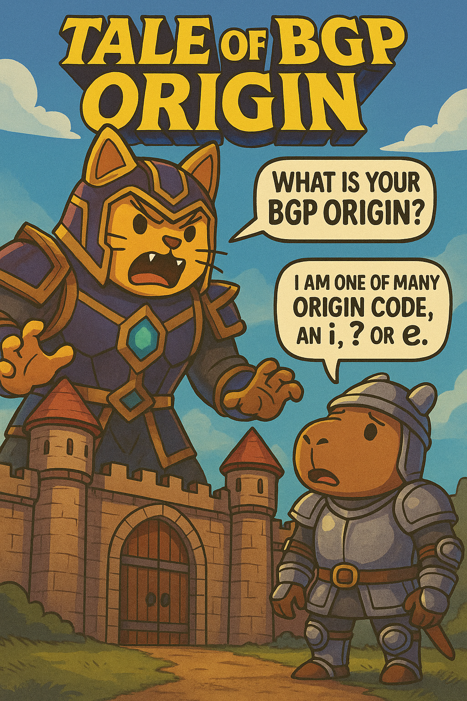
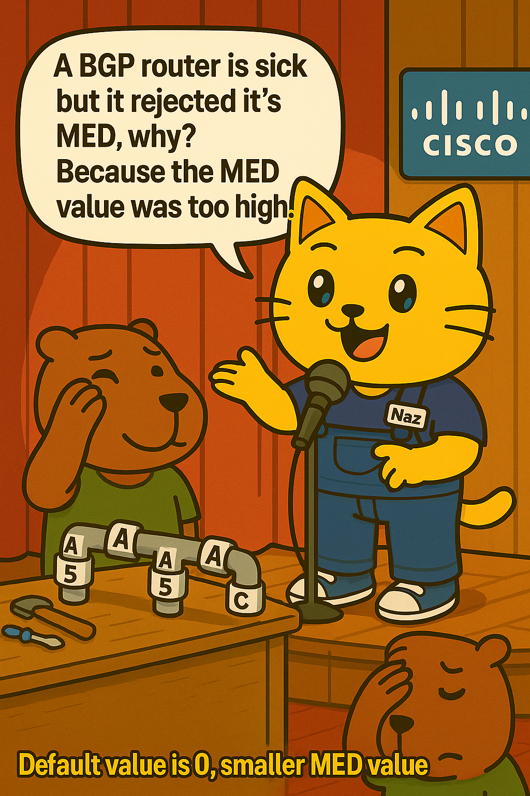
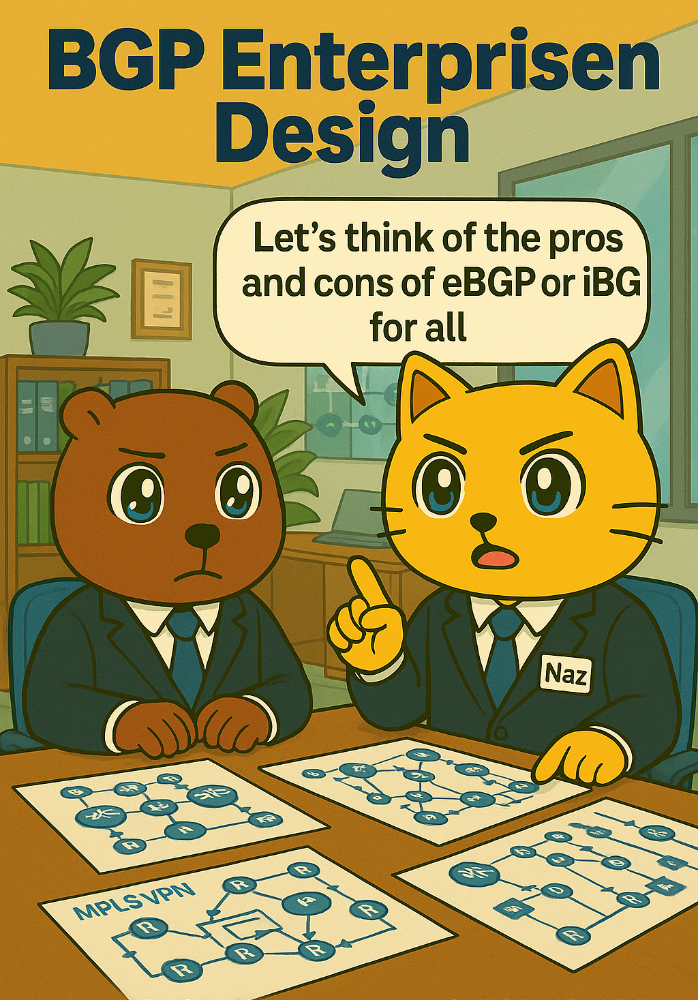
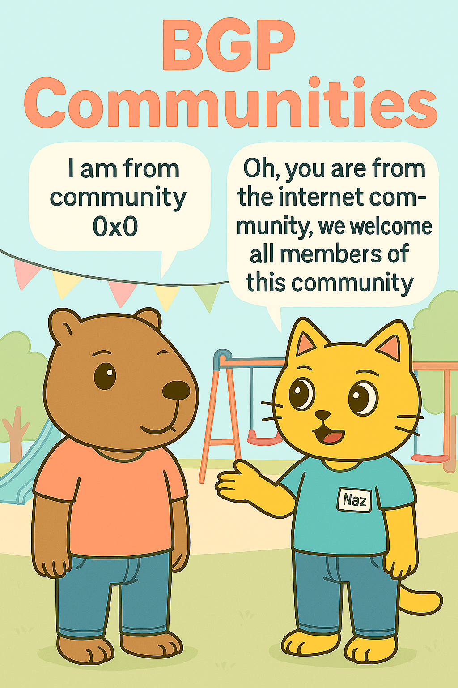
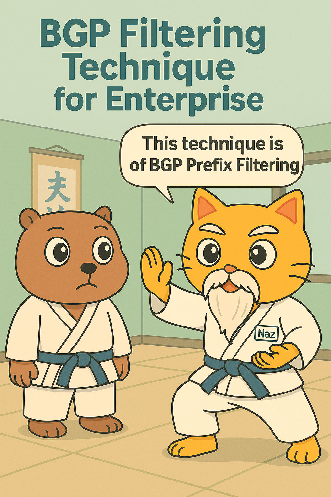

# 🐱 The BGP Cat Series

**Learn BGP one comic at a time.**

  

The BGP Cat Series is a set of illustrated study notes on the Border Gateway Protocol. Each topic opens with a cartoon cover in which Naz the cat and a bear friend act out the idea (picking an AS path of destiny in space, guarding a prefix-list gate, teaching filtering in a karate dojo), and is followed by a focused set of notes you can read in a few minutes.

Every note follows the same shape:

- **The concept** in plain language
- **Key rules and defaults** in quick-reference tables
- **Cisco IOS configuration** examples you can lab straight away
- **Common gotchas** that catch people out in exams and in production
- **A troubleshooting toolkit** of `show` and `debug` commands

The examples use Cisco IOS syntax, but the BGP behaviour behind them applies to any vendor.

> By [Nazirul Roslan](https://www.linkedin.com/in/nazirulroslan)

---

## 📚 Contents

| # | Topic | What you'll learn |
|---|---|---|
| 001 | [AS-Path](notes/001-bgp-as-path.md) | AS_SEQUENCE vs. AS_SET, loop prevention, prepending, `local-as`, `allowas-in` |
| 002 | [Weight](notes/002-bgp-weight.md) | Cisco's router-local preference knob, defaults, per-neighbor vs. route-map |
| 003 | [Route Maps](notes/003-route-maps.md) | Sequences, match and set, the permit/deny puzzle, the implicit deny |
| 004 | [Prefix Lists](notes/004-prefix-lists.md) | How `ge` and `le` really work, plus eight patterns worth memorising |
| 005 | [Best Path Selection](notes/005-bgp-best-path-selection.md) | The full Cisco decision process, step by step, and every tie-breaker |
| 006 | [Origin Code](notes/006-bgp-origin-code.md) | `i` vs. `e` vs. `?`, how each is set, and why it matters |
| 007 | [MED](notes/007-bgp-med.md) | Steering inbound traffic, `deterministic-med` and `always-compare-med` |
| 008 | [Enterprise Design](notes/008-bgp-enterprise-design.md) | iBGP vs. eBGP inside your network, and the `remove-private-as` options |
| 009 | [Communities](notes/009-bgp-communities.md) | Tagging routes, well-known communities, graceful shutdown |
| 010 | [Filtering Techniques](notes/010-bgp-filtering-techniques.md) | ACLs vs. prefix lists, distribute-lists and route maps for filtering |

---

## 🖼️ Meet the Covers

<table>
  <tr>
    <td align="center"><a href="notes/001-bgp-as-path.md"> <b>001 AS-Path</b></a></td>
    <td align="center"><a href="notes/002-bgp-weight.md"> <b>002 Weight</b></a></td>
    <td align="center"><a href="notes/003-route-maps.md"> <b>003 Route Maps</b></a></td>
    <td align="center"><a href="notes/004-prefix-lists.md"> <b>004 Prefix Lists</b></a></td>
    <td align="center"><a href="notes/005-bgp-best-path-selection.md"> <b>005 Best Path</b></a></td>
  </tr>
  <tr>
    <td align="center"><a href="notes/006-bgp-origin-code.md"> <b>006 Origin</b></a></td>
    <td align="center"><a href="notes/007-bgp-med.md"> <b>007 MED</b></a></td>
    <td align="center"><a href="notes/008-bgp-enterprise-design.md"> <b>008 Enterprise</b></a></td>
    <td align="center"><a href="notes/009-bgp-communities.md"> <b>009 Communities</b></a></td>
    <td align="center"><a href="notes/010-bgp-filtering-techniques.md"> <b>010 Filtering</b></a></td>
  </tr>
</table>

---

## 🧭 Suggested Reading Order

New to BGP policy? This order builds each idea on the last:

1. **Attributes first:** [AS-Path](notes/001-bgp-as-path.md) → [Weight](notes/002-bgp-weight.md) → [Origin](notes/006-bgp-origin-code.md) → [MED](notes/007-bgp-med.md)
2. **Then how they're compared:** [Best Path Selection](notes/005-bgp-best-path-selection.md)
3. **Then the policy toolbox:** [Prefix Lists](notes/004-prefix-lists.md) → [Route Maps](notes/003-route-maps.md) → [Filtering Techniques](notes/010-bgp-filtering-techniques.md) → [Communities](notes/009-bgp-communities.md)
4. **Finally, putting it together:** [Enterprise Design](notes/008-bgp-enterprise-design.md)

Already comfortable with the basics? Jump straight to [Best Path Selection](notes/005-bgp-best-path-selection.md) and use the others as reference.

---

## 💬 Feedback

Spotted a mistake or have an idea for the next cover? Open an issue or reach out on [LinkedIn](https://www.linkedin.com/in/nazirulroslan).
