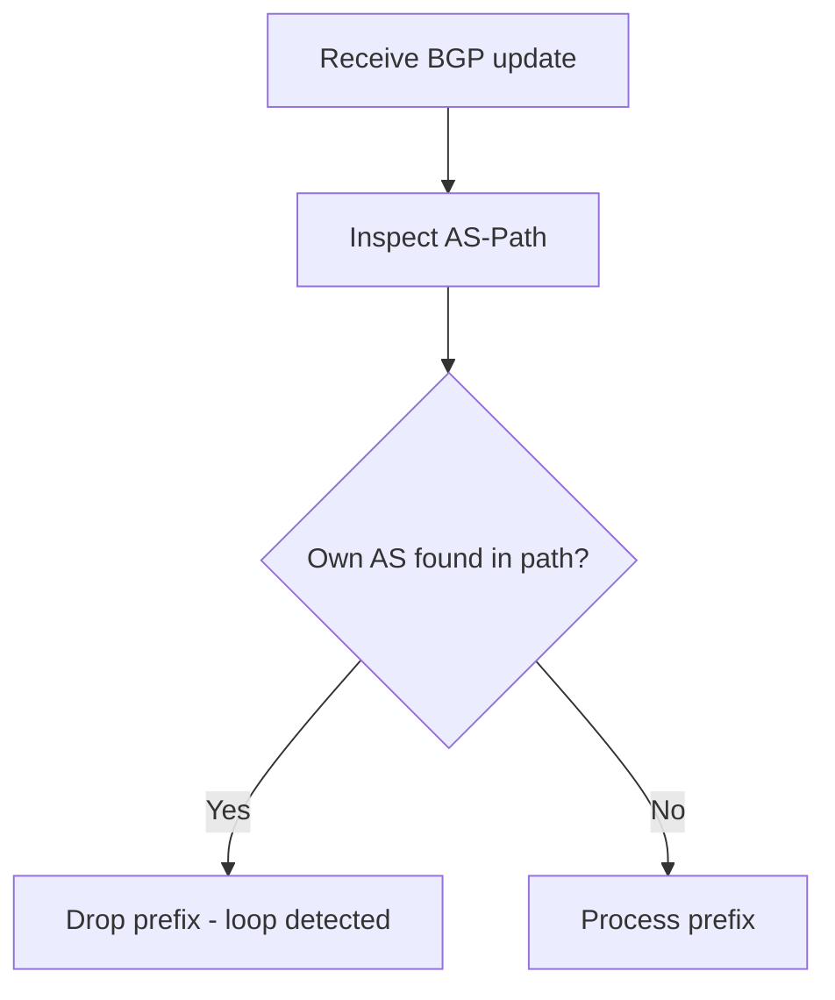

# Navigating the BGP Landscape: Understanding the AS-Path Attribute


> Study notes by [Nazirul Roslan](https://www.linkedin.com/in/nazirulroslan)

---

## 1. The AS-Path: A Critical Internet Component

The AS-Path attribute is a fundamental element of BGP, the protocol that lets different networks (Autonomous Systems) exchange routing information. It guides traffic to its destination efficiently and without loops, and it must be present in every BGP update.

| Property | What it means |
|---|---|
| **Well-Known Mandatory** | Every BGP implementation must recognize it, and it **must** be present in every BGP update. |
| **Dual core functions** | **Loop prevention** and **best path selection**. |

---

## 2. AS-Path Representations

The AS-Path can appear in different forms, each conveying specific information about a route's history.

### AS-SEQUENCE (the standard)

An **ordered** list of AS numbers the route has traversed. The most recent AS is on the left, the origin on the right.

```
Example path:  AS3 AS2 AS1

AS3 (Peer)  <--  AS2 (Transit)  <--  AS1 (Origin)
```

Each AS in the sequence adds 1 to the path length used in best path selection.

### AS-SET (the aggregator)

An **unordered** list of AS numbers, typically found in summarized or aggregated routes.

```
Example path:  AS_Aggregator {AS_X, AS_Y, AS_Z}
```

The entire AS-SET counts as only **one hop** for path length.

### Confederation segments

`AS_CONFED_SEQUENCE` and `AS_CONFED_SET` are used only inside a BGP confederation. From outside, the confederation looks like a single AS.

```
Internal view:  (65001) 65200
External view:  65000
```

Confederation segments are **not counted** in the AS-Path length.

---

## 3. AS-Path in Action

### Loop prevention

The fundamental rule: if a router sees **its own AS number** in a received route's AS-Path, it discards the route.



### Best path selection

When higher-priority attributes are equal, BGP prefers the path with the **shortest AS-Path length**.

| Path | AS hops | Result |
|---|---|---|
| Path A | 2 | ✅ Preferred |
| Path C | 3 | |
| Path B | 4 | |

---

## 4. AS-Path Manipulation

Administrators can manipulate the AS-Path to influence how traffic flows.

### AS-Path prepending

**Goal:** make a path less attractive by artificially lengthening it, adding your own AS number several times to the AS-Path sent to a neighbor.

```
Original path:   AS_X
Prepend 3x  ->   AS_X AS_X AS_X AS_X
```

### `local-as`

**Goal:** appear as a different AS to a specific neighbor, typically during ISP mergers or AS migrations, so customers don't need to change their configuration immediately.

**ISP merger scenario:**

```
Customer (still configured to peer with AS_Old)
        |
     peering
        |
ISP_New (real AS) configured with: local-as AS_Old
```

ISP_New "impersonates" AS_Old toward that customer during the transition period.

### `allowas-in`

**Goal:** accept routes that legitimately contain the router's own AS, overriding default loop prevention. Common in hub-and-spoke designs where several customer sites share one AS across an ISP.

```
Cust. Site A (AS_Cust)
        |
       ISP
        |
Cust. Site B (AS_Cust)  <-- needs allowas-in
```

Site B receives Site A's route through the ISP, and the path contains `AS_Cust`, so it would be dropped without `allowas-in`.

> ⚠️ **Caution:** `allowas-in` disables default loop prevention for that neighbor. Only use it when you fully understand the topology.

---

## 5. Troubleshooting Toolkit: Viewing the AS-Path in Cisco IOS

### Interpreting `show ip bgp`

The **Path** column shows the AS-Path. Recognize the representations:

| Representation | How it looks |
|---|---|
| AS-SEQUENCE | `65001 65002 i` |
| AS-SET (aggregated route) | `65003 {65004,65005} i` (curly braces) |
| AS_CONFED_SEQUENCE (internal view) | `(65101) 65200 i` (parentheses) |

```
show ip bgp
```
Displays the BGP table and AS-Paths.

### Checking a specific prefix

```
show ip bgp <PREFIX>
```
Shows detailed information for one prefix, including the AS-Path and other attributes of every known path.

### Verifying advertised and received routes

```
show ip bgp neighbors <IP> advertised-routes
```
Shows routes sent to a neighbor, including the AS-Path. Useful for verifying prepending.

```
show ip bgp neighbors <IP> received-routes
```
Shows routes received from a neighbor **before** inbound policy is applied, so you see the original AS-Path. Requires `neighbor <IP> soft-reconfiguration inbound` to be configured.

---

## 6. The Enduring Importance of AS-Path

The AS-Path is a cornerstone of BGP. Its roles in loop prevention and best path selection keep global routing stable and scalable, while its representations and manipulation techniques show how BGP balances fundamental stability with policy flexibility.
