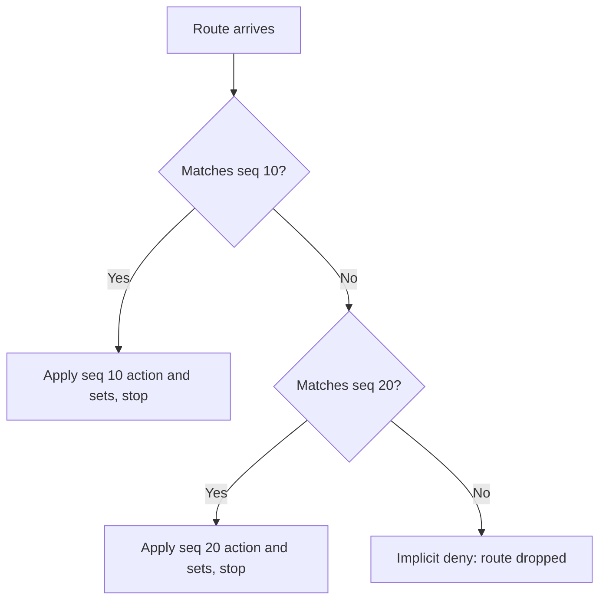

# Mastering Cisco Route Maps


> Study notes by [Nazirul Roslan](https://www.linkedin.com/in/nazirulroslan)

---

## 1. What Are Route Maps?

Route maps are the "Swiss Army knife" of Cisco IOS for influencing routing protocol behavior.

- **Purpose:** **filter** routes, or **modify** their attributes (metrics, BGP path attributes), during redistribution or as routing protocols process them.
- **Why needed:** they give more granular control than plain ACLs or prefix lists, and can match on route tags, route types, or BGP attributes.

---

## 2. Anatomy of a Route Map

### Key components

- **Named construct:** each route map has a unique, descriptive name.
- **Sequences:** one or more numbered entries. Default increment is 10 (10, 20, 30...).
- **Action:** each sequence is either `permit` or `deny`.

### Logic: IF-THEN-ELSE

| Step | Meaning |
|---|---|
| **IF** | the `match` conditions are met... |
| **THEN** | apply the `set` commands (if any) and follow the sequence's `permit` / `deny` |
| **ELSE** | move to the next sequence |

---

## 3. How They Are Processed

- **Top-down evaluation:** sequences are checked from the lowest number to the highest.
- **First match wins:** once a route matches a sequence, that sequence's action is taken and **processing stops for that route**.
- **Implicit deny:** a route that matches no sequence hits an invisible **deny all** at the end and is dropped, unless you add a final `permit` sequence (usually with no `match`) to catch everything else.



---

## 4. Core Mechanics: `match` and `set`

### `match` criteria (the "IF")

- IP prefixes / lengths (via ACLs or prefix lists)
- Route tags
- BGP attributes (AS_PATH, community, and so on)
- Route types (for example OSPF internal or external)
- Metric values
- **No `match` statement = matches EVERYTHING**

**Multiple `match` statements in one sequence:**

| Situation | Logic |
|---|---|
| Different fields (`match ip address ACL_1` + `match metric 50`) | **AND**: both must be true |
| Same field type (`match ip address ACL_1` + `match ip address ACL_2`) | **OR**: either can be true |

### `set` actions (the "THEN")

Modify attributes of matching routes:

- `set as-path prepend ...`
- `set local-preference ...`
- `set weight ...`
- `set metric ...`
- `set community ...`
- `set tag ...`
- and many more, depending on the protocol

> `set` commands only take effect in a `permit` sequence.

---

## 5. The `permit` / `deny` Logic Puzzle

Two different `permit`/`deny` decisions are involved, and mixing them up is a classic mistake.

**Route-map sequence action** (`route-map MY_MAP permit|deny 10`) is the final decision for routes that match:

- `permit`: the route is allowed and the `set` commands apply.
- `deny`: the route is filtered and `set` commands are ignored.

**ACL / prefix-list action** (inside `match ip address ...`) only decides whether the route **matches**:

- ACL line says `permit` and the route matches it: the `match` is TRUE, so the sequence's action applies.
- ACL line says `deny` and the route matches it: the `match` is FALSE, so the route moves on to the next sequence.

| ACL/prefix-list says | Route-map sequence says | Result |
|---|---|---|
| permit | permit | Route allowed (sets applied) |
| permit | deny | Route dropped |
| deny | permit or deny | No match, go to next sequence |

> ✅ **Best practice: keep it simple.** Use `permit` entries in ACLs/prefix lists called by route maps, and put the real allow/drop decision on the route-map sequence.

---

## 6. Common Applications

### Route filtering

Deny `192.168.0.0/16` during redistribution, permit everything else.

```
ip prefix-list PRIVATE_NETS permit 192.168.0.0/16 le 32

route-map FILTER_REDIST deny 10
 match ip address prefix-list PRIVATE_NETS
! Matched 192.168.x.x routes are denied

route-map FILTER_REDIST permit 20
! No match statement = match all, so everything else is permitted

router ospf 1
 redistribute bgp 65001 subnets route-map FILTER_REDIST
```

### BGP attribute manipulation

AS-Path prepending for specific prefixes.

```
ip prefix-list PREPEND_TARGET permit 10.1.1.0/24

route-map PREPEND_AS_PATH permit 10
 match ip address prefix-list PREPEND_TARGET
 set as-path prepend 65001 65001 65001
! Prepend own AS three times

route-map PREPEND_AS_PATH permit 20
! Other routes permitted without modification

router bgp 65001
 neighbor 1.2.3.4 route-map PREPEND_AS_PATH out
```

Other common BGP `set` commands:

- `set local-preference 200`: influences outbound path choice across the AS (shared over iBGP)
- `set weight 40000`: router-local influence, higher is better

---

## 7. Golden Rules & Best Practices

- **Clarity is king:** put the main logic in the route-map `permit`/`deny`; keep ACLs/prefix lists mostly `permit`.
- **Test rigorously:** always lab-test route maps first. A mistake can cause a major outage.
- **The final say:** add a last `route-map YOUR_MAP permit <seq>` with no `match` if everything else should pass. This overrides the implicit deny.
- **Order matters:** sequence numbers decide the flow. Plan them, and leave gaps for future entries.
- **Document it:** comment your route maps and the lists they use, and explain the intent.

---

## 8. Troubleshooting Toolkit

```
show route-map [map-name]
show ip bgp [prefix]
show ip bgp neighbors <ip> advertised-routes
show ip bgp neighbors <ip> received-routes
debug ip routing
debug ip bgp updates [neighbor-ip] [in|out]
clear ip bgp * soft [in|out]
```

- `show route-map` shows each sequence and its match counters, the quickest way to see which sequence a route hit.
- `received-routes` needs `neighbor <ip> soft-reconfiguration inbound` configured.
- Use `debug` commands carefully in production.
