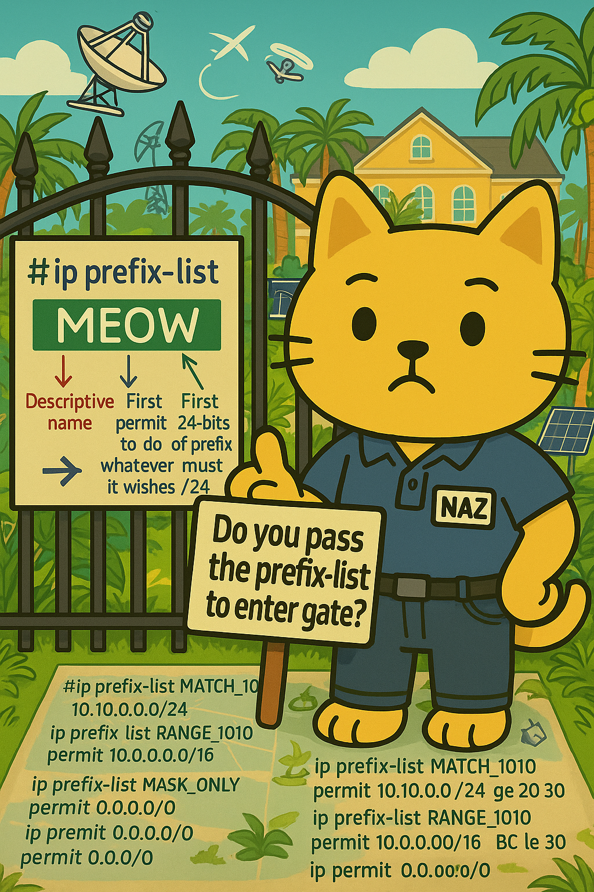

# Mastering Cisco Prefix Lists



> Study notes by [Nazirul Roslan](https://www.linkedin.com/in/nazirulroslan)

---

## 1. What Are Prefix Lists?

Cisco prefix lists are flexible tools for matching IP prefixes (routes) **and** their subnet mask lengths. They are used mostly with BGP.

- **Purpose:** classify routes by prefix and/or mask length, for filtering or manipulation of advertisements and redistribution.
- **Cisco advantage:** they can match a prefix **and a range of mask lengths**, giving far more precision than ACLs.
- **Context is key:** what `permit`/`deny` means depends on where the list is used (directly on a BGP neighbor vs. inside a route map).

---

## 2. Anatomy of a Prefix List

```
ip prefix-list <LIST_NAME> [seq <SEQ_NUM>] {permit | deny} <PREFIX/LENGTH> [ge <MIN_LEN>] [le <MAX_LEN>]
```

| Part | Meaning |
|---|---|
| `LIST_NAME` | Descriptive name |
| `seq <SEQ_NUM>` | Optional. Auto-assigned in steps of 10 if omitted |
| `permit` / `deny` | Action when an entry matches (see below) |
| `PREFIX/LENGTH` | The network bits that must match, e.g. `192.168.1.0/24` |
| `ge <MIN_LEN>` | Mask length **≥** MIN_LEN (up to /32, or up to `le` if given) |
| `le <MAX_LEN>` | Mask length **≤** MAX_LEN (down to LENGTH, or down to `ge` if given) |

**What `permit` / `deny` means:**

- **Applied directly** (e.g. `neighbor x.x.x.x prefix-list NAME in`): `permit` allows the route, `deny` drops it.
- **Inside a route map** (`match ip address prefix-list NAME`): `permit` means "this route matches", `deny` means "this route does not match", so the route map moves on to its next sequence.

---

## 3. Matching Logic

- **Sequential:** entries are checked from lowest sequence number to highest.
- **First match wins:** the first matching entry decides, and **processing stops** for that route.
- **Implicit deny:** a route matching no entry is denied.
- **`PREFIX/LENGTH` is the base:** `10.0.0.0/8` means the first 8 bits must be `00001010`.

### Without `ge` / `le`: exact match

```
ip prefix-list EXACT_MATCH permit 192.168.1.0/24
```

Matches **only** `192.168.1.0/24`. `192.168.1.0/25` does **not** match.

### With `ge` / `le`: a range of mask lengths

```
ip prefix-list SUBNET_RANGE permit 10.0.0.0/8 ge 16 le 24
```

Matches any route whose first 8 bits are `10.` **and** whose mask is /16 to /24 inclusive, e.g. `10.1.0.0/16`, `10.2.3.0/24`, `10.50.48.0/20`.

---

## 4. Common Prefix Lists & Their Effects

| # | Goal | Prefix list | Matches |
|---|---|---|---|
| 1 | Exact prefix and mask | `permit 172.16.30.0/24` | Only `172.16.30.0/24` |
| 2 | Prefix with a mask range | `permit 10.0.0.0/8 ge 16 le 24` | `10.x` routes with /16–/24 |
| 3 | Mask length only, any prefix | `permit 0.0.0.0/0 ge 20 le 30` | Any IPv4 route with /20–/30 |
| 4 | Default route only | `permit 0.0.0.0/0` | Only `0.0.0.0/0` |
| 5 | Everything | `permit 0.0.0.0/0 le 32` | Any IPv4 route, any mask |
| 6 | Host routes only | `permit 0.0.0.0/0 ge 32` | Any /32 |
| 7 | More-specifics of a prefix | `permit 10.0.0.0/8 ge 9` | `10.x` routes with /9–/32 (not the /8 itself) |
| 8 | Prefix up to a max length | `permit 192.168.0.0/16 le 24` | Inside `192.168.0.0/16`, masks /16–/24 |

Notes on a few of these:

- **#6:** `ge 32` and `ge 32 le 32` are equivalent, because `ge` already runs up to /32.
- **#7:** use `ge 8` instead of `ge 9` if you also want the /8 itself.
- **#8:** `192.168.0.0/16 le 16` matches only the /16, since `le` counts down only to the base length.

---

## 5. Key Rules & Tips

- **`ge` / `le` order:** `le` must be ≥ `ge`. `ge 20 le 24` is valid; `ge 24 le 20` is **rejected**.
- **Base length rule:** the base LENGTH must be shorter than `ge` (`LENGTH < ge ≤ le ≤ 32`).
- **No `eq` operator:** to match one exact mask length across many prefixes, use `ge N le N`:

```
ip prefix-list ONLY_SLASH_24 permit 0.0.0.0/0 ge 24 le 24
```

- **Two ways to apply:**
  - Directly on a BGP neighbor: `neighbor <IP> prefix-list <NAME> {in | out}`. The list both classifies and filters.
  - Inside a route map: `match ip address prefix-list <NAME>`. The list classifies; the route-map sequence decides permit/deny.
- **IPv6:** same idea with `ipv6 prefix-list <NAME> ...`.
- **Clarity:** use descriptive names like `DENY_PRIVATE_IPS` or `PERMIT_DEFAULT_ONLY`.

---

## 6. Troubleshooting Toolkit

```
show ip prefix-list [name]
```
Shows the configuration and hit counts per entry.

```
show ip prefix-list detail [name]
```
More detailed output, including hit counts and sequence information.

```
show ip bgp neighbors <IP> {advertised-routes | received-routes | routes}
```
Shows the effect of a prefix list applied to a BGP neighbor. `received-routes` needs `soft-reconfiguration inbound`.

```
debug ip bgp updates [neighbor-ip] [in|out]
```
Shows updates being processed, including filtered routes. Use with caution in production.

```
clear ip bgp * soft [in|out]
```
Re-applies policy (including prefix lists) without resetting sessions.
