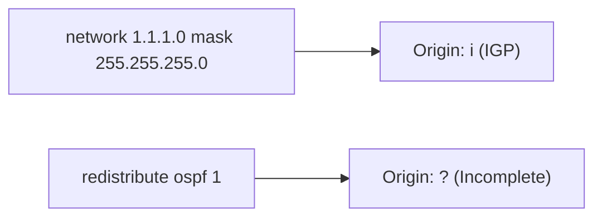

# The Tale of BGP Origin Codes


> Study notes by [Nazirul Roslan](https://www.linkedin.com/in/nazirulroslan)

---

## 1. What is the BGP Origin Code?

The **Origin** is a **well-known mandatory** path attribute: every BGP speaker must recognize it, and it is present in every BGP update. It tells other routers **how a route was first injected into BGP**, and it is one of the steps in best path selection.

---

## 2. Origin Code Values & Preference

| Code | Name | Meaning | Preference |
|---|---|---|---|
| `i` | IGP | Originated inside the AS with the BGP `network` command (also `aggregate-address`) | ✅ **Most preferred** |
| `e` | EGP | Learned via the historic Exterior Gateway Protocol | Middle (obsolete, rarely seen) |
| `?` | Incomplete | Origin unknown, most commonly **redistributed** from an IGP, static or connected routes | ❌ **Least preferred** |

- **`i`** is treated as the "cleanest" entry into BGP: the prefix was explicitly defined as part of the AS.
- **`e`** normally only appears with very old legacy systems.
- **`?`** isn't bad, it just says BGP doesn't know where the route came from before redistribution.

---

## 3. Role in Best Path Selection

In Cisco's decision process, Origin is checked **after** Weight, Local Preference, locally originated, (AIGP) and AS path length, and **before** MED.

If everything earlier is tied, the lower origin code wins:

```
i (IGP)   >   e (EGP)   >   ? (Incomplete)
```

---

## 4. How the Origin Is Set (Cisco IOS)

### `network` command → `i`

```
router bgp 65001
 network 192.168.1.0 mask 255.255.255.0
! 192.168.1.0/24 is originated with Origin 'i'
```

### `redistribute` command → `?`

```
router bgp 65001
 redistribute ospf 1
! Routes redistributed from OSPF process 1 get Origin '?'
```



---

## 5. Manipulating the Origin with Route Maps

You can override the origin with `set origin` in a route map, for routes you advertise or to influence local selection.

### Example: change `?` to `i` for some redistributed routes

```
ip prefix-list MY_INTERNAL_ROUTES permit 10.0.0.0/8 le 24
!
route-map REDIST_TO_IGP_ORIGIN permit 10
 match ip address prefix-list MY_INTERNAL_ROUTES
 set origin igp            ! Force origin to 'i'
!
route-map REDIST_TO_IGP_ORIGIN permit 20
 ! Other routes pass unchanged (they keep '?')
!
router bgp 65001
 redistribute ospf 1 route-map REDIST_TO_IGP_ORIGIN
```

> ⚠️ **Caution:** changing `?` to `i` misrepresents how the route entered BGP. It can confuse troubleshooting and, without a well-understood policy, cause suboptimal routing. For path manipulation inside your AS, Local Preference or Weight are usually the better tools.

---

## 6. Displaying the Origin in Cisco IOS

### `show ip bgp`

The origin code is the last character of each line.

```
Router# show ip bgp
BGP table version is 20, local router ID is 192.168.1.1
Status codes: s suppressed, d damped, h history, * valid, > best, i - internal
Origin codes: i - IGP, e - EGP, ? - incomplete

   Network          Next Hop            Metric LocPrf Weight Path
*>i 10.10.10.0/24   172.16.0.1               0    100      0 65002 i
*   172.17.0.0/24   203.0.113.1              0             0 100 ?
*>                  198.51.100.1             0             0 101 i
```

Reading it:

- `10.10.10.0/24` has origin **`i`**.
- `172.17.0.0/24` via `203.0.113.1` has origin **`?`**.
- `172.17.0.0/24` via `198.51.100.1` has origin **`i`**, and it is the best path (`>`).

Both `172.17.0.0/24` paths tie on weight, local preference and AS path length (one AS each), so **Origin decides**: `i` beats `?`.

> Two reading tips: the `i` right after `*>` is the **status code** "internal" (learned via iBGP), not the origin. And a continuation line with a blank Network column is another path to the prefix above it.

### `show ip bgp <NETWORK>`

```
show ip bgp 172.17.0.0/24
```

Detailed view of one prefix, including the origin of every path.

---

## 7. Best Practices & Nuances

- **Use `network` for your own prefixes:** it correctly sets origin `i`, which other networks tend to prefer.
- **Accept `?` for redistribution:** it's the normal, honest result of redistributing IGP or static routes. Only change it for a specific, well-understood policy reason.
- **External impact:** the origin is carried to eBGP peers, so other ASes may prefer your `i` paths over your `?` paths.
- **Troubleshooting value:** the origin quickly tells you how a route got into BGP.

---

## 8. Glossary

| Term | Meaning |
|---|---|
| Origin code | Mandatory BGP attribute showing how a prefix was injected into BGP |
| `i` (IGP) | Injected with `network` (or `aggregate-address`). Most preferred |
| `e` (EGP) | Learned via historic EGP. Obsolete |
| `?` (Incomplete) | Injected via redistribution or unknown. Least preferred |
| Best path selection | The algorithm BGP uses to choose one best route among several |
| `network` command | Originates a prefix that exists in the routing table into BGP with origin `i` |
| `redistribute` command | Injects routes from another protocol (or static/connected) into BGP with origin `?` |
| Route map | Cisco policy tool, can change BGP attributes such as the origin |
