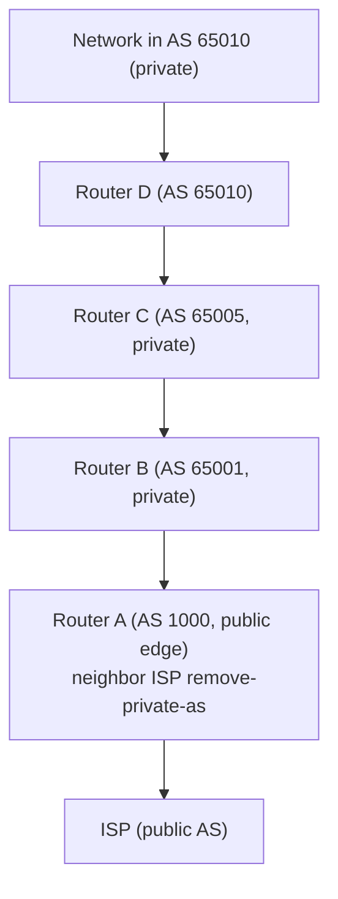

# BGP Enterprise Design: iBGP vs. eBGP & Private AS Handling


> Study notes by [Nazirul Roslan](https://www.linkedin.com/in/nazirulroslan)

---

## 1. Why Use BGP in an Enterprise?

BGP runs the internet, but it's also useful inside enterprise networks.

- **Multi-homing to ISPs:** connecting to two or more ISPs for redundancy or load sharing usually requires BGP. iBGP then shares routes (including defaults) internally so a backup path is always available.
- **Inter-company route exchange:** controlled route exchange with partners, especially when each side runs a different IGP (OSPF, EIGRP, IS-IS). BGP gives much finer policy control than plain redistribution.
- **Large-scale scalability:** very large internal networks can use BGP to carry huge numbers of routes beyond what IGPs handle comfortably.

---

## 2. Intra-AS Design: iBGP vs. eBGP

When BGP runs across many devices inside your network, you choose between **iBGP everywhere** or **eBGP between internal segments** that each use a private AS number.

### Using iBGP internally

**Pros**

- **Local Preference:** powerful AS-wide control of outbound path choice.
- **IGP metric influence:** iBGP best path considers the IGP cost to the next hop, so path choice follows the physical topology.
- **Simple public view:** external peers see one public AS.
- **Route reflectors:** far fewer neighbor statements than a full mesh.

**Cons**

- **Next-hop reachability:** needs an IGP (or static routes) so every iBGP speaker can reach next hops that may be several hops away.
- **iBGP split horizon:** routes learned from one iBGP peer are not advertised to another iBGP peer, so you need a full mesh, route reflectors, or confederations.

### Using eBGP internally (private ASes)

**Pros**

- **No iBGP split horizon:** eBGP peers readvertise freely.
- **IGP possibly not needed:** if every session is between directly connected interfaces, next hops are always reachable.
- **AS_PATH-based selection:** shortest AS path is a natural tie-breaker.

**Cons**

- **More neighbor statements:** for example, a 7-router design might need 21 eBGP neighbor statements vs. about 11 for iBGP with one route reflector. A larger design might need 47 vs. 22 (with 2 RRs).
- **Private ASN planning:** needs careful allocation of private AS numbers (see the table below).
- **Longer AS paths:** every internal hop adds an AS. (A single AS_PATH segment holds at most 255 ASNs.)
- **Must strip private ASNs** before advertising to public ISPs.

### Private AS number ranges

| Type | Range | Count |
|---|---|---|
| 2-byte private | `64512` – `65534` | 1023 |
| 4-byte private | `4200000000` – `4294967294` | ~95 million |

`65535` is reserved and not usable as a private AS.

### Side-by-side

| | iBGP internally | eBGP internally (private ASes) |
|---|---|---|
| Needs an IGP | Yes (next-hop reachability) | Not necessarily |
| Split horizon issue | Yes (full mesh / RR / confed) | No |
| Main path-selection tool | Local Preference, IGP metric | AS_PATH length |
| Neighbor statements | Fewer (with RRs) | More |
| Extra edge work | None | Strip private ASNs |

---

## 3. Handling Private AS Numbers with `remove-private-as`

When you use private ASNs internally, they **must not** leak to the internet. The edge router strips them with `remove-private-as` on the neighbor facing the ISP.

```
router bgp <local-public-as>
 neighbor <ISP_PEER_IP> remote-as <ISP_AS_NUMBER>
 neighbor <ISP_PEER_IP> remove-private-as [all] [replace-as]
```

It only works toward **eBGP** neighbors.

### Option 1: `remove-private-as` (default behavior)

- Strips private ASNs only when the AS path contains **only private ASNs**.
- If the path mixes public and private ASNs, **nothing is removed**.

Example path `100 300 65001 65002 405`: the private `65001 65002` sit between public ASNs, so the default command leaves them in place.

### Option 2: `remove-private-as all`

- Removes **every** private ASN, wherever it appears in the path.
- Useful when private ASNs can end up mixed with public ASNs as routes travel through your network.

### Option 3: `remove-private-as [all] replace-as`

- Removes the private ASNs (all of them if `all` is included)...
- ...and **replaces each one with your own public AS number**.
- The path length stays the same, so the path doesn't suddenly look "shorter" to the ISP.

Example: path `... 65001 65002` from local AS 1000 becomes `... 1000 1000`.

| Option | Mixed public/private path | Path length after |
|---|---|---|
| `remove-private-as` | Nothing removed | Unchanged |
| `remove-private-as all` | All private ASNs removed | Shorter |
| `remove-private-as all replace-as` | Private ASNs swapped for local AS | Same length |

---

## 4. Configuration Examples

### Example 1: `remove-private-as all`

Router A (AS 100) peers with Router B (AS 200, `172.30.0.7`).

**Router A config and table:**

```
router bgp 100
 neighbor 172.30.0.7 remote-as 200
 neighbor 172.30.0.7 remove-private-as all

RouterA# show ip bgp 1.1.1.1
BGP routing table entry for 1.1.1.1/32, version 2
Paths: (1 available, best #1, table default)
  Advertised to update-groups:
     1          2
  1001 65200 65201 65201 1002 1003 1003
    19.0.101.1 from 19.0.101.1 (19.0.101.1)
      Origin IGP, localpref 100, valid, external, best
```

**Router B receives:**

```
RouterB# show ip bgp 1.1.1.1
BGP routing table entry for 1.1.1.1/32, version 3
Paths: (1 available, best #1, table default)
  Not advertised to any peer
  100 1001 1002 1003 1003
    172.30.0.6 from 172.30.0.6 (19.1.0.1)
      Origin IGP, localpref 100, valid, external, best
```

**Observation:** the private ASNs `65200 65201 65201` are gone, and Router A's AS `100` is prepended as usual.

### Example 2: `remove-private-as all replace-as`

```
router bgp 100
 neighbor 172.30.0.7 remote-as 200
 neighbor 172.30.0.7 remove-private-as all replace-as
```

Same path on Router A (`1001 65200 65201 65201 1002 1003 1003`). **Router B receives:**

```
RouterB# show ip bgp 1.1.1.1
BGP routing table entry for 1.1.1.1/32, version 3
Paths: (1 available, best #1, table default)
   Not advertised to any peer
   100 1001 100 100 100 1002 1003 1003
     172.30.0.6 from 172.30.0.6 (192.168.1.2)
       Origin IGP, localpref 100, valid, external, best
```

**Observation:** each of the three private ASNs was replaced by `100`, keeping the path length.

---

## 5. Use Case: Enterprise with Private ASNs Peering with an ISP



The path Router A receives is `65001 65005 65010`, all private, so even the default `remove-private-as` strips it. The ISP sees only `1000`.

---

## 6. Troubleshooting & Verification

```
show ip bgp neighbors <ISP_PEER_IP> advertised-routes
```
On the edge router: exactly what you send the ISP. Confirm the private ASNs are gone.

```
show ip bgp
```
On the edge router: paths as learned from internal eBGP peers, **with** the private ASNs still present.

```
debug ip bgp updates <ISP_PEER_IP> out
```
Shows outgoing updates after `remove-private-as` is applied. Use with caution.

```
show ip bgp summary
```
Status of all BGP sessions (internal eBGP and the ISP peering).

---

## 7. Glossary

| Term | Meaning |
|---|---|
| Intra-AS BGP | BGP deployed inside one organization for internal routing |
| iBGP | BGP between routers in the **same** AS |
| eBGP | BGP between routers in **different** ASes, possibly private ASes inside one enterprise |
| Multi-homing | Connecting to two or more ISPs |
| Private AS numbers | `64512–65534` (2-byte) and `4200000000–4294967294` (4-byte), never advertised to the internet |
| `remove-private-as` | Strips private ASNs from the AS path toward an eBGP peer |
| Route reflector (RR) | Removes the need for an iBGP full mesh |
| IGP | Interior routing protocol (OSPF, EIGRP, IS-IS), often needed for iBGP next-hop reachability |

---

## 8. Sources & Further Reading

- Own notes on enterprise BGP design.
- Cisco, "Removing Private AS Numbers from the AS Path in BGP".
- RFC 6996, "Autonomous System (AS) Reservation for Private Use".
