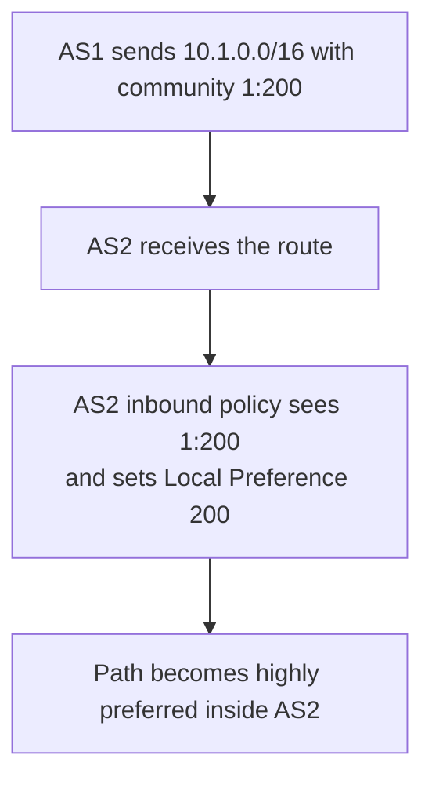

# Understanding BGP Communities


> Study notes by [Nazirul Roslan](https://www.linkedin.com/in/nazirulroslan)

---

## 1. What Are BGP Communities?

A **BGP community** is an **optional transitive** attribute used to **tag** routes that share a common property. The tag itself doesn't change best path selection. Its power is that policies can **match on the tag** and act on a whole group of routes at once (set Local Preference, block advertisement, and so on) without long prefix lists.

### Key characteristics

- **Optional transitive:** it may or may not be present; if present, it is passed on to other peers (as long as `send-community` is configured).
- **Format:** usually written `AS:TAG` (the "new format"). Some systems show it as one 32-bit decimal number. On Cisco IOS, enable readable output with:

```
ip bgp-community new-format
```

- **Standard vs. extended vs. large:**

| Type | Size | Typical use |
|---|---|---|
| Standard | 32-bit (`AS:TAG`) | General tagging and policy |
| Extended | 64-bit | MPLS VPNs (route targets), EVPN |
| Large | 96-bit (`AS:X:Y`) | Tagging with 4-byte AS numbers (RFC 8092) |

---

## 2. Quick Reference: Well-Known Communities

| Name | Value | Effect |
|---|---|---|
| `NO_EXPORT` | `0xFFFFFF01` (`65535:65281`) | Don't advertise to eBGP peers. Keeps the route inside the receiving AS (or confederation) |
| `NO_ADVERTISE` | `0xFFFFFF02` (`65535:65282`) | Don't advertise to **any** peer. The route stops at the receiving router |
| `LOCAL_AS` / `NO_EXPORT_SUBCONFED` | `0xFFFFFF03` (`65535:65283`) | Don't advertise outside the local sub-AS of a confederation |
| `GRACEFUL_SHUTDOWN` | `65535:0` | Signals planned maintenance so peers can reroute first (RFC 8326) |
| `internet` (Cisco keyword) | `0:0` | Matches or tags routes that may be advertised to everyone |

---

## 3. Configuration & Verification

### Setting a community (outbound)

Two steps, and the second is the one people forget:

1. A route map that matches the prefixes and applies `set community`.
2. `neighbor <ip> send-community` so the community is actually sent. **Cisco IOS strips communities by default.**

```
! 1. Define prefixes to match
ip prefix-list OUR-CUSTOMER-ROUTES permit 100.100.0.0/16
!
! 2. Route map to set the community
route-map SET_COMMUNITY_OUT permit 10
  match ip address prefix-list OUR-CUSTOMER-ROUTES
  set community 65001:888 additive
!
route-map SET_COMMUNITY_OUT permit 20
  ! Other routes pass without a new community
!
! 3. Apply outbound and enable sending
router bgp 65001
  neighbor 192.168.1.2 remote-as 65002
  neighbor 192.168.1.2 send-community both
  ! 'standard', 'extended', or 'both'. 'both' is a safe default
  neighbor 192.168.1.2 route-map SET_COMMUNITY_OUT out
```

> `additive` **adds** the community to any existing ones. Without it, `set community` **replaces** all existing communities.

### Matching a community (inbound)

1. Define the community with an `ip community-list`.
2. Match it in a route map with `match community`.
3. Apply an action, such as Local Preference or Weight.

```
! On the receiving router (AS 65002)
! 1. Community list
ip community-list 10 permit 65001:888
!
! 2. Match and set
route-map PROCESS_COMMUNITY_IN permit 10
  match community 10
  set local-preference 150
!
route-map PROCESS_COMMUNITY_IN permit 20
!
! 3. Apply inbound
router bgp 65002
  neighbor 192.168.1.1 remote-as 65001
  neighbor 192.168.1.1 route-map PROCESS_COMMUNITY_IN in
```

---

## 4. Practical Use Case: Influencing a Neighbor's Policy

One AS signals its preference; the neighbor has agreed to act on those tags.



AS1 tags, AS2 acts. This scales much better than maintaining prefix lists for every scenario, and many ISPs publish a list of communities customers can use this way.

---

## 5. Advanced Use Case: BGP Graceful Shutdown

### The problem: packet loss during maintenance

If a BGP session is simply shut down, traffic can be dropped while the network converges onto another path (in the worst case, until the hold timer expires, 180 seconds by default).

### The solution: the GSHUT community

With **graceful shutdown**, before tearing the session down the router re-advertises its routes with:

- the well-known **`GRACEFUL_SHUTDOWN`** community (`65535:0`), and
- a **lowered Local Preference**, so they become less attractive.

Peers move traffic to alternate paths first. Only after the configured timer (30–65535 seconds) does the session actually close, giving a hitless maintenance window. The receiving side can also match `65535:0` in its own policy (for example, set a low Local Preference) to honor the signal.

### Configuration example (Cisco IOS)

```
! On the router being taken down (e.g. Router3)
router bgp 12345
  neighbor 2.2.2.2 shutdown graceful 60 local-preference 50
  ! Re-advertises routes with GSHUT and local-preference 50,
  ! then shuts the session after 60 seconds
```

---

## 6. Verification & Troubleshooting Toolkit

### Common pitfall: the community isn't being sent

**Problem:** the route map sets a community, but the neighbor never sees it.
**Cause:** `neighbor <ip> send-community` is missing.

```
! 1. On the receiving router (before the fix): no community
R2# show ip bgp 100.100.0.0
BGP routing table entry for 100.100.0.0/16
...
    192.168.1.1 from 192.168.1.1 (1.1.1.1)
      Origin IGP, metric 0, localpref 100, valid, external, best

! 2. On the sending router (the fix)
R1(config)# router bgp 65001
R1(config-router)# neighbor 192.168.1.2 send-community
R1(config-router)# end
R1# clear ip bgp 192.168.1.2 soft out

! 3. On the receiving router (after the fix): community visible
R2# show ip bgp 100.100.0.0
BGP routing table entry for 100.100.0.0/16
...
    192.168.1.1 from 192.168.1.1 (1.1.1.1)
      Origin IGP, metric 0, localpref 100, valid, external, best
      Community: 65001:888
```

### Other useful commands

```
show ip bgp neighbors <ip> received-routes
```
Routes from a neighbor **before** inbound policy. Confirms whether the peer sent the community at all. Needs `soft-reconfiguration inbound`.

```
show ip bgp community <AS:TAG> [exact-match]
```
All routes carrying that community. `exact-match` shows only routes whose community list is exactly that value.

```
show ip community-list [number | name]
```
Verifies what your community lists permit or deny.

---

## 7. Glossary

| Term | Meaning |
|---|---|
| BGP community | Optional transitive attribute used to tag routes for policy |
| Standard community | 32-bit value, written `ASN:VALUE` |
| Extended community | 64-bit value, used by MPLS VPNs and EVPN (e.g. route targets) |
| Large community | 96-bit value `ASN:X:Y`, suited to 4-byte ASNs |
| Well-known community | Predefined meaning, e.g. `no-export`, `graceful-shutdown` |
| Custom community | Value and meaning defined by the network operator |
| Community list | ACL-like list that matches routes by community |
| `send-community` | Neighbor command required to send communities to a peer |

---

## 8. Sources & Further Reading

- Cisco, "BGP Graceful Shutdown".
- RFC 1997, "BGP Communities Attribute".
- RFC 4360, "BGP Extended Communities Attribute".
- RFC 8092, "BGP Large Communities Attribute".
- RFC 8326, "Graceful BGP Session Shutdown".
