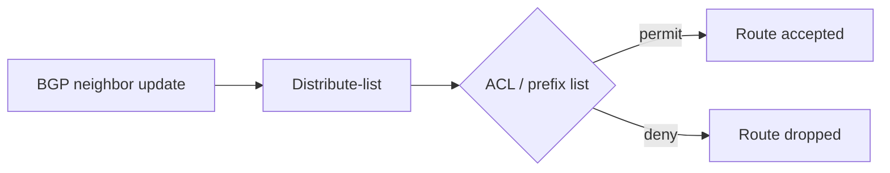

# BGP Filtering Techniques for Enterprise Networks


> Study notes by [Nazirul Roslan](https://www.linkedin.com/in/nazirulroslan)

---

## 1. Why Filter BGP Routes?

Filtering is a core BGP task for **security**, **policy** and **stability**. Typical goals:

- Block unwanted or invalid prefixes (for example private space like `192.168.0.0/16`) from entering your network.
- Control which of your own prefixes are advertised to external peers.

Cisco IOS offers several tools to classify routes by **prefix** and **subnet mask**.

---

## 2. Quick Reference: BGP Prefix Filtering Tools

| Tool | Prefix match | Mask match | How it's applied |
|---|---|---|---|
| Standard ACL | Yes (address bits only) | ❌ No | Inside a `distribute-list` or `route-map` |
| Extended ACL | Yes | ⚠️ Yes, but awkward (e.g. "/20 or longer") | Inside a `distribute-list` or `route-map` |
| **Prefix list** | Yes | ✅ Precise ranges with `ge` / `le` | **Directly on the neighbor**, or inside `distribute-list` / `route-map` |
| Distribute list | Uses an ACL or prefix list | (from the list) | On the neighbor |
| Route map | Uses an ACL or prefix list | (from the list) | On the neighbor. Most flexible: can filter **and** change attributes |

> In the configs below, `x.x.x.x` is a placeholder for a real BGP neighbor address.

---

## 3. Classification Tools

### Standard ACLs

The most basic tool. They only look at the address bits, so they have **no idea of the subnet mask**. A `deny` blocks every prefix inside the range, whatever its mask length.

**Example: deny `160.10.0.0/16` and all its subnets**

```
! Denies 160.10.0.0/16, 160.10.1.0/24, 160.10.2.8/29, etc.
access-list 1 deny   160.10.0.0 0.0.255.255
access-list 1 permit any
!
router bgp 10
  neighbor x.x.x.x distribute-list 1 in
```

### Extended ACLs

When used for BGP route filtering, an extended ACL's "source" fields match the **prefix** and its "destination" fields match the **subnet mask**. That allows mask matching, but the syntax is hard to read, and ranges like "/20 to /24" are awkward.

**Example: deny any `160.x.x.x` prefix with a mask of /20 or longer**

```
! Source = prefix 160.x.x.x ; destination = mask with at least the first 20 bits set
! Matches masks /20, /21, ... /32
access-list 101 deny   ip 160.0.0.0 0.255.255.255 255.255.240.0 0.0.15.255
access-list 101 permit ip any any
!
router bgp 10
  neighbor x.x.x.x distribute-list 101 in
```

### Prefix lists (recommended)

**Prefix lists are the preferred tool for prefix filtering in BGP.** Built for the job: clear syntax and precise mask ranges with `ge` and `le`.

**Example: deny `150.x.x.x` prefixes with masks /20 to /24**

```
ip prefix-list BLOCK_SPECIFIC_RANGES deny   150.0.0.0/8 ge 20 le 24
ip prefix-list BLOCK_SPECIFIC_RANGES permit 0.0.0.0/0 le 32
!
router bgp 10
  neighbor x.x.x.x prefix-list BLOCK_SPECIFIC_RANGES in
```

---

## 4. Application Methods

### Using a `distribute-list`

A general-purpose filter that references an ACL or prefix list. The logic is simple: if the list **permits** the route, it's allowed; if it **denies**, the route is blocked.



**Caveat: address-family mode.** Where the command goes depends on how BGP is configured:

- **Legacy config:** directly under the neighbor, `neighbor x.x.x.x distribute-list MY_ACL in`.
- **Address-family config:** must go under the address family. Commands placed outside it won't take effect for that AF.

```
! Address-family mode example
router bgp 10
  address-family ipv4
    neighbor x.x.x.x activate
    neighbor x.x.x.x distribute-list MY_ACL in
```

### Using a `route-map` (most flexible)

A route map references an ACL or prefix list. It's one more layer of config, but you can later add attribute changes (Local Preference, communities, and so on) in the same place.

```
! Route map references the prefix list
route-map FILTER_IN permit 10
  match ip address prefix-list BLOCK_SPECIFIC_RANGES
!
router bgp 10
  neighbor x.x.x.x route-map FILTER_IN in
```

How this works:

- Routes the prefix list **permits** are a match for sequence 10, which is a `permit`, so they're **accepted**.
- Routes the prefix list **denies** (`150.x` with /20–/24) are **not a match**, fall through to the route map's implicit deny, and are **dropped**.

---

## 5. Best Practices & Common Pitfalls

- **Prefer prefix lists:** for BGP prefix filtering they should be your default. Clearer and more precise than ACLs.
- **Implicit deny:** ACLs, prefix lists and route maps all end with an invisible `deny all`. Finish with `permit any` / `permit 0.0.0.0/0 le 32` if unmatched routes should pass.
- **Direction is key:** `in` filters what you receive; `out` filters what you advertise. The wrong direction can, for example, block all your outgoing routes.
- **Address-family awareness:** in AF mode, neighbor policies belong inside the address family.
- **Start small, verify often:** add one rule, apply it, check with `show` commands, then build up.
- **Soft reset after changes:** use `clear ip bgp x.x.x.x soft in|out` so new filters take effect without dropping the session.

---

## 6. Verification & Troubleshooting Toolkit

### Routes received before filtering

```
show ip bgp neighbors <NEIGHBOR_IP> received-routes
```

The most important command for inbound filters: everything the neighbor sent, **before** your inbound policy. If the route isn't here, the problem is on the neighbor's side. Requires `neighbor <NEIGHBOR_IP> soft-reconfiguration inbound`.

### Routes after filtering

```
show ip bgp
```

The BGP table **after** inbound filtering. A route that appears in `received-routes` but not here is being blocked by your filter.

### Verify the filter logic

```
show ip prefix-list [NAME]
show access-lists [NUMBER | NAME]
```

View your lists and their **hit counters**, which show how many times each line matched.

---

## 7. Glossary

| Term | Meaning |
|---|---|
| Distribute list | Applies an ACL or prefix list to filter routes for a routing protocol |
| Prefix list | Matches IP prefixes and mask lengths, with `ge` / `le` ranges |
| Route map | Policy tool that matches (ACLs, prefix lists, attributes) and permits, denies, or sets attributes |
| Address family | BGP config mode per address type (IPv4, IPv6, VPNv4...). Changes where policies are applied |
| Wildcard mask | Used in ACLs to mark which bits must match; the inverse of a subnet mask |
